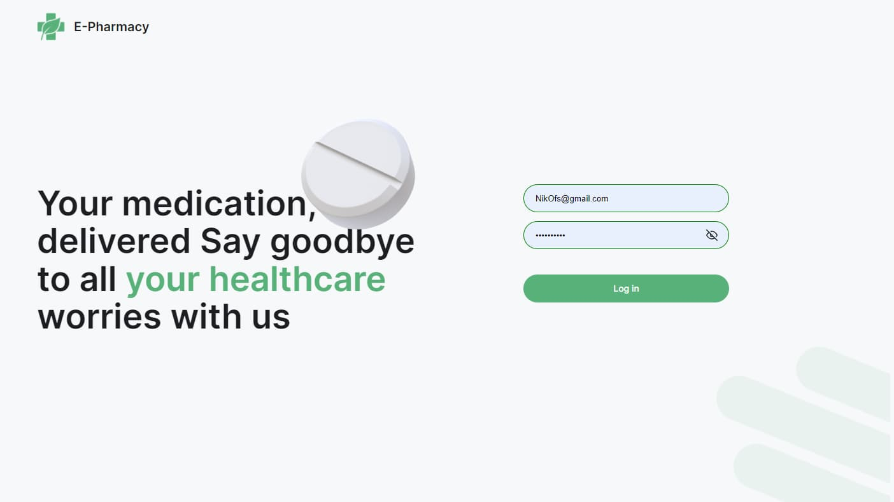
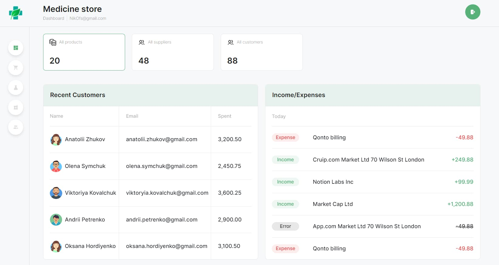
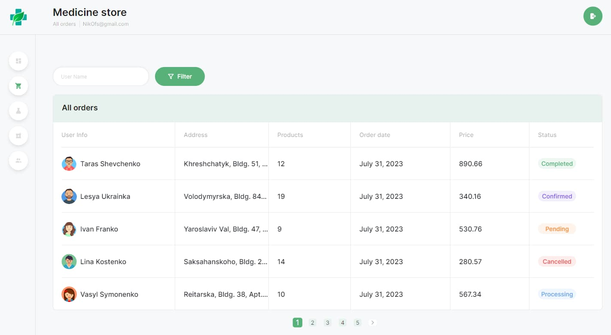
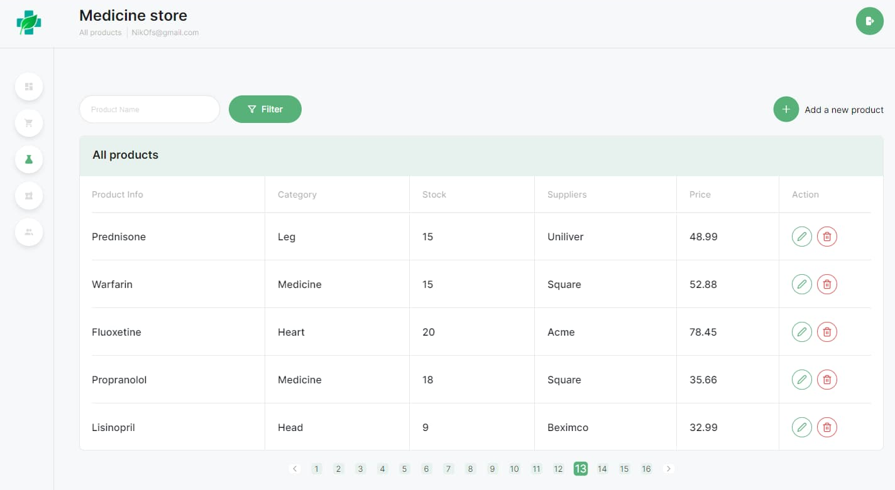
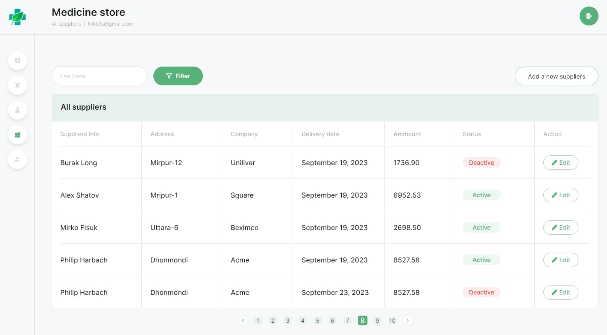
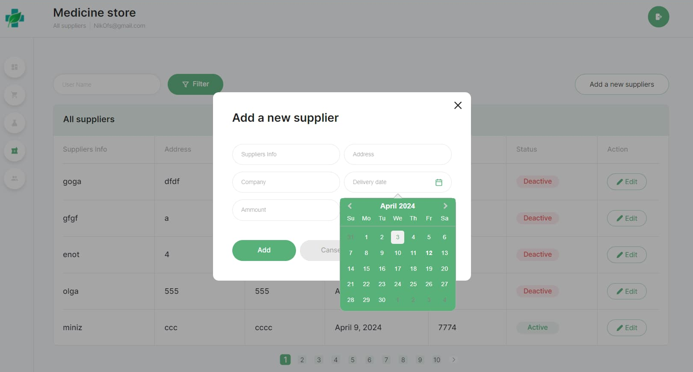
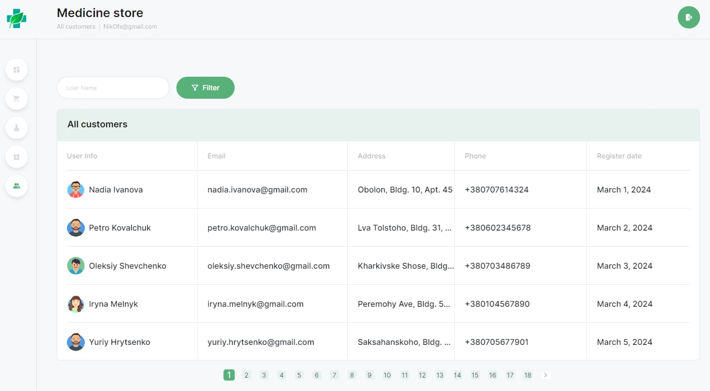
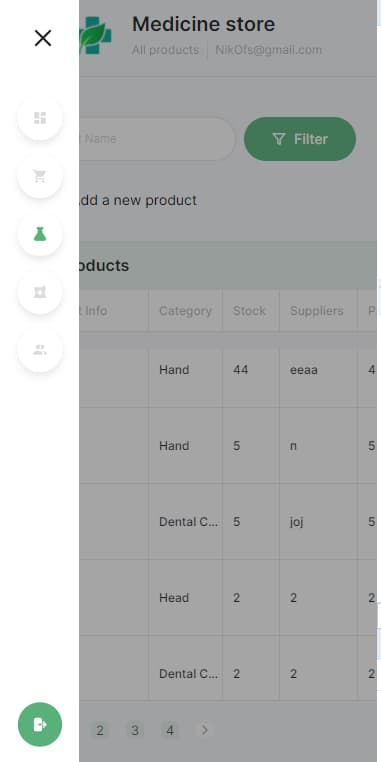
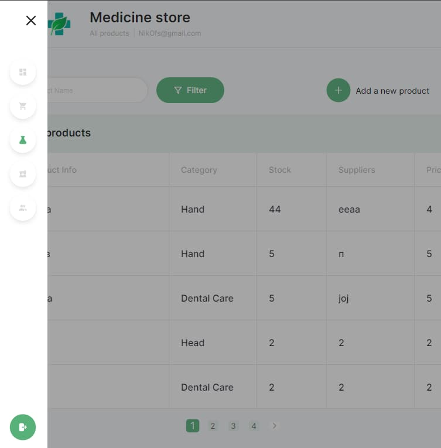

# E-Pharmacy Management System

Welcome to the E-Pharmacy Management System, a comprehensive digital solution designed for managing a medical store's operations seamlessly. This platform allows administrators and staff to efficiently track and manage products, orders, suppliers, and customers.

## Features

1. **Login Page** 
- **Administrator Access:**  Administrators can log in using their credentials. Upon successful login, they are redirected to their dashboard within the administrative panel.

2. **Dashboard** 
- **Overview:** Users land on the Dashboard after logging in, which presents key statistics and metrics.
- **Recent Customers:** Displays recent customer activity and details.
- **Income/Expenses:** Shows recent financial transactions and summaries.
- **Inventory Summary:** Provides counts of total products, suppliers, and customers.

3. **All Orders Page** 
- **Order Management:** Displays a table with brief details of all orders including user info, address, products, order date, price, and status.

4. **All Products Page** 
- **Product Management:** Users can view all products, add new products, or modify/delete existing products.

5. **All Suppliers Page** 
- **Supplier Management:** Displays all supplier details with options to edit existing records or add new suppliers.

6. **All Customers Page** 
- **Customer Management:** Provides a complete list of customers with detailed information.

7. **Global Filtering** 
- **Enhanced Search:**  All pages include filtering capabilities that allow users to efficiently navigate and manage large sets of data.

8. **Adaptive Design** 
- **Non-Mobile Responsive:**  The layout is adaptive and responsive, designed for optimal viewing on devices except mobile phones.

## Technology Stack
- **Frontend:** JavaScript, React, Styled-component, React Router, Redux Toolkit, Axios, Formik, Yup, React Toastify, React Datepicker...
- **Backend:** Node.js, Express, MongoDB with Mongoose, Joi, CORS, Nodemon, Jsonwebtoken (JWT), Morgan...

Technical task frontend: [https://docs.google.com/spreadsheets/d/1ufIlG2HwqppnY1by3HD4l6TVGq4EoW_o8b-ubA-pQq4/edit#gid=0](https://docs.google.com/spreadsheets/d/1ufIlG2HwqppnY1by3HD4l6TVGq4EoW_o8b-ubA-pQq4/edit#gid=0)
Technical task backend: [https://docs.google.com/spreadsheets/d/1ufIlG2HwqppnY1by3HD4l6TVGq4EoW_o8b-ubA-pQq4/edit#gid=808577346](https://docs.google.com/spreadsheets/d/1ufIlG2HwqppnY1by3HD4l6TVGq4EoW_o8b-ubA-pQq4/edit#gid=808577346)

Layout: [https://www.figma.com/file/z1JklHHxX8kTGo3zWvlzat/Admin-dashboard?type=design&node-id=0-1&mode=design&t=MGYiWG8DvQE6pXE2-0](https://www.figma.com/file/z1JklHHxX8kTGo3zWvlzat/Admin-dashboard?type=design&node-id=0-1&mode=design&t=MGYiWG8DvQE6pXE2-0)

Performance criteria

For any inquiries or assistance, please contact us at [ovsyannikovnikolai1790@gmail.com](ovsyannikovnikolai1790@gmail.com).

Thank you for choosing our LearnLingo Platform!